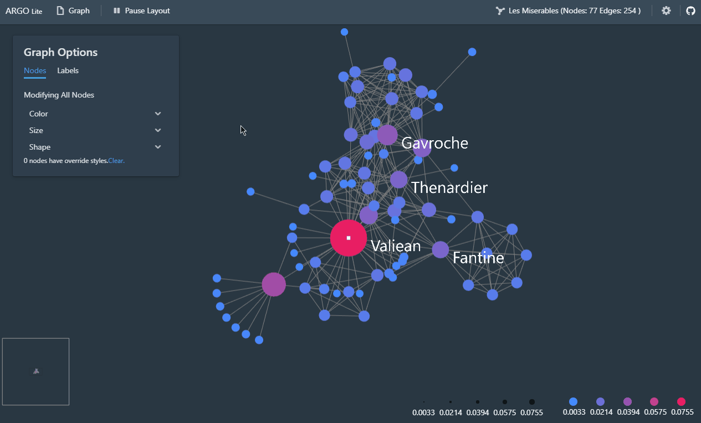

# Argo Lite

An interactive graph visualization system that runs in your web browsers. No installation needed.

**Live Demo:** https://poloclub.github.io/argo-graph-lite/

## Import Data

Argo Lite allows users to play around sample data or upload your own data. Currently we support CSV/TSV graph files for undirected graphs. We are working on supporting more formats in the future.

## Interactive Graph Layout

You can apply force layout algorithms on graphs interactively. We are working on supporting more layout algorithms in the future.

## Publish your Graph As a Link

You can publish your "graph snapshot" as a link to share with friends and colleagues. You can also save it locally as a file.

You will be able to load the snapshot from your saved file or from the shared link to work on them again. Note that each snapshot associated with a link is immutable, so if you modify a shared graph, you need to share again to get a new link. The original link will still point to the graph before your modification.

## Developers

Argo Lite is actively being developed by Siwei Li, Omar Shaikh, Frank Zhou, Anish Upadhayay from [Polo Club of Data Science](https://poloclub.github.io) at [Georgia Tech](http://www.gatech.edu).
