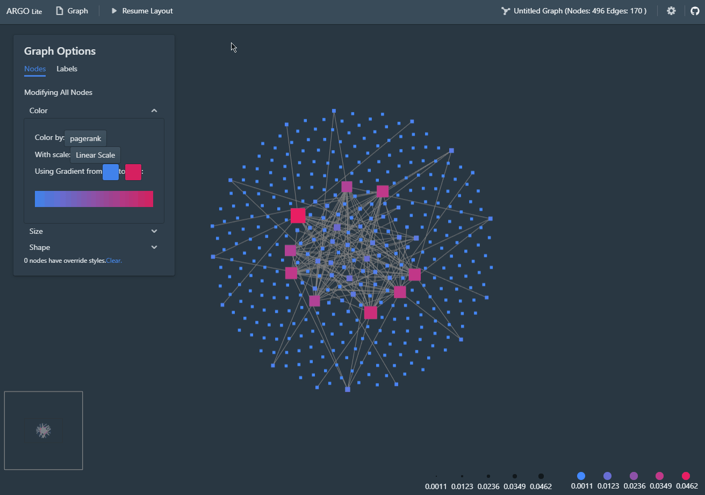
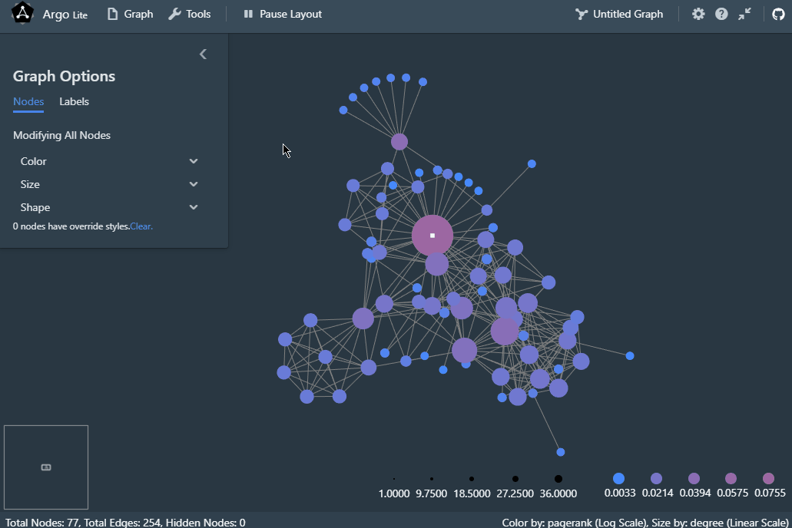

# Argo Lite

An interactive graph visualization system that runs in your web browsers. No installation needed.

[**Live Demo** - Launch Argo Lite in your browser](https://poloclub.github.io/argo-graph-lite/)

## Documentations

- [Quick Start (Visualization, Saving and Sharing Snapshots)](quickstart.md)
- [Tutorial - Visualizing a citation graph of COVID-19 publications (Import Data, Incremental Exploration)](tutorial.md)
- [Develop Argo Lite](development.md)
- [Deploy Argo Lite (and custom sharing service with access)](deploy.md)

## Feature Highlights

### Interactive Graph Visualization

Visualize your graph with interactive force-directed layout, automatic sizing and coloring by pagerank, and full control over every node for customization!

### Incremental Exploration

Argo Lite empowers you to incrementally explore large graphs. Start by several import nodes (with high PageRank or degree) or by a node that you are interested in, and add their neighbor nodes to expand your visualization!

### Save and Publish via URLs

You can publish your "graph snapshot" as a URL link. Anyone with the link will be able to access and continue their exploration from this snapshot. You can still save the snapshot locally as a file if you prefer.

If you are working on sensitive or proprietary data, and prefer to set up a private sharing server with access control, please refer to [Deploying Argo Lite and Sharing backend service](deploy.md)

You will be able to load the snapshot from your saved file or from the shared link to work on them again. Note that each snapshot associated with a link is immutable, so if you modify a shared graph, you need to share again to get a new link. The original link will still point to the graph before your modification.

### Embed into Web Pages

Argo Lite allows you to embed your interactive graph visualization snapshots into iframe-based web widgets! You can embed them into web articles, blog posts and even interactive notebooks such as Jupyter Notebooks. Tell a story with your graph!

---

♥ Developed and maintained by [Polo Club of Data Science](https://poloclub.github.io/). [MIT License](LICENSE).
