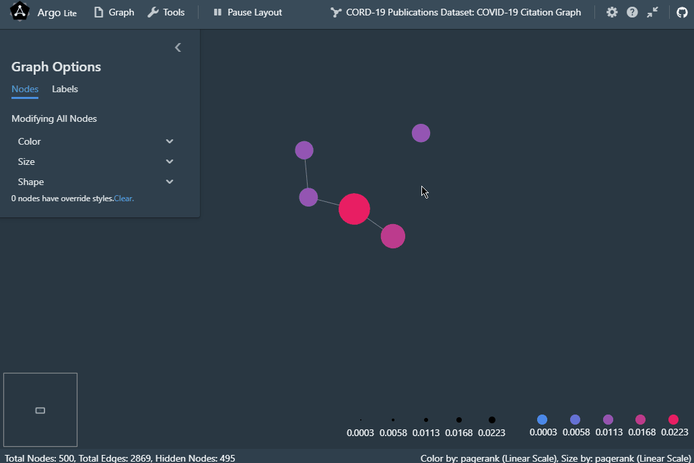

# Argo Lite Tutorial with the CORD-19 Dataset

This tutorial assumes that you have already completed [the Quick Start Guide](quickstart.md). In addition to the quick start, this tutorial covers:

- How to import your data from CSV/TSV and GEXF files
- How to incrementally explore large graphs

We have prepared a real-world example graph - the COVID-19 publication citation network, derived from the [CORD-19 Open Research Dataset](https://www.semanticscholar.org/cord19/get-started).

This dataset is frequently updated, so if you are interested in getting the most up-to-date citation graph, we have provided [a script](https://github.com/poloclub/cord-19-citation-graph) for reference on extracting this graph.

Now let's get started!

## Importing graph data

Argo Lite supports importing multiple types of graph and network formats. You can import CSV/TSV graph files or GEXF files (we'll probably add more types later).

You only need to import the graph once, and then you can work with graph snapshots (sharable by URLs) without touching any file again.

You can find sample files to import in the `samples` directory of this repository.

Now try using `Graph -> Import...`.

At the end of the import dialog, you will see an option `After import, show [...]`. Since this graph is larger than the Les Miserable one we have used in the Quick Start, and visualizing all of the nodes together would likely be visually overwhelming, so let's choose to visualize `top 10 nodes with highest PageRank scores` for now.

(Note that you can always do this later using `Tools -> Filters` or `Tools -> Data Sheet`).

During the import, Argo Lite will compute the PageRank and degrees values of each node automatically.

## Incrementally Adding Neighbors

Now with the top 10 nodes (with highest PageRank scores) showing, let's try to add some neighbor nodes!

In this dataset, each node is a COVID-19 related publication. Find a paper that you find interesting. If you are not interested in any of the 10 papers above, you can also use `Tools -> Data Sheet` to search and select an interesting paper and add it to the visualization.

Now select 1 paper that you find interesting, you will see a `Neighbors (xx nodes hidden)` button on the floating selection menu. Clicking on it will bring you to the *Neighbor Menu*.

In the *Neighbor Menu*, you can see a table listing all the neighbor nodes and their attributes. You can sort them by their attributes, individually add or hide them in the graph, or use the tools above to add an arbitrary number of neighbors with top PageRank or degree values. This helps you identify highly cited papers that has cited or is cited by the current selected paper that you are interested in.

If you are using a mouse (as opposed to a touchscreen device), you can find a shortcut to do the same thing by right clicking a node.

You can also individually manage nodes in `Tools -> Data Sheet`.

When you are done, save or share your snapshot using the `Graph` menu!

## Next Steps

Congratulations! You have learned how to import graph data as well as incremnetally exploring a graph. If you are interested in customizing Argo Lite or deploying your own sharing service, please refer to [the Development Guide](development.md) and [the Deployment Guide](deploy.md)